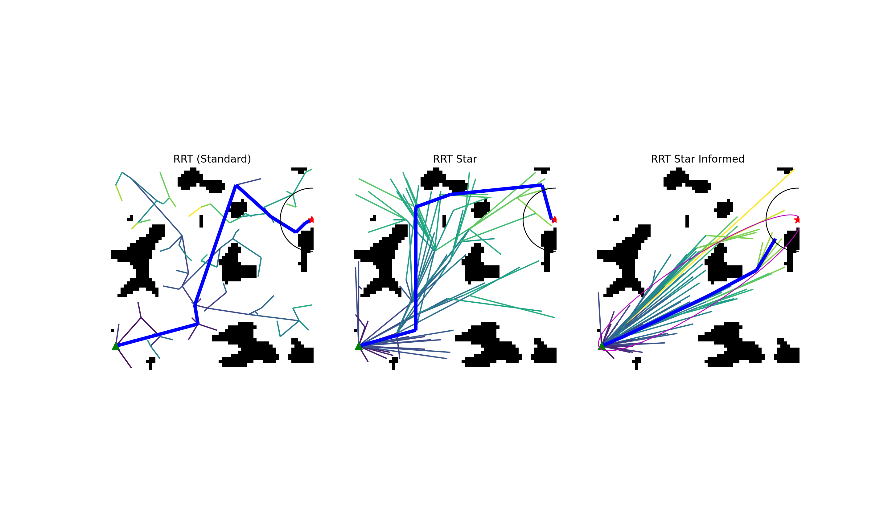

# RRT Path planning with Python!



This package contains the standard RRT and RRT* algorithms, written in python, as well as the variant RRT* Informed.

See also [http://lavalle.pl/rrt/](LaValle's RRT Page.)

It uses networkx graphs with points assigned to nodes as datastructures for the trees. It uses Bresenham's line collision algorithm to calculate collisions with obstacles.

The test worlds are made from Perlin noise.

~~~Slices of 3-d perlin noise are used to simulate dynamic environments; those can be animated with the animation module (currently broken)~~~

## Installation

```
pip install git+https://github.com/rland93/rrt_pathplanner
```
Also requires the [`perlin-numpy`](https://github.com/pvigier/perlin-numpy) package to make the random worlds. You need to install that one manually.